# DucatiPanigaleCanBus

- [What is DucatiPanigaleCanBus?](#what-is-ducatipanigalecanbus)
- [Setup of Harry Lap Timer](#setup-of-harry-lap-timer)
  - [aud](#aud)
- [Building the software in Platform IO and Arduino IDE](#building-the-software-in-platform-io-and-arduino-ide)
  - [OTA updates with DoubleResetDetector](#ota-updates-with-doubleresetdetector)
- [Schematics](#schematics)
- [Hardware](#hardware)
  - [An example based on common DevKit ESP32 module](#an-example-based-on-common-devkit-esp32-module)
  - [An example of a compact unit based on Wemos D1mini 32](#an-example-of-a-compact-unit-based-on-wemos-d1mini-32)
- [Credits](#credits)

## What is DucatiPanigaleCanBus?

If you are a motorcycle rider/racer, you might want to log data from your bike to improve your riding style.
This project connects a small device based on ESP32 to the CAN Bus on a Ducati Panigale (or other Ducati bikes with similar ECU), it monitors and extracts RPM/speed/gear/temperature, and it broadcasts the collected data via Bluetooth Low Energy to Harry Lap Timer 'Engine sensor'. Other apps can be supported (for example, [NBP in TrackAddict](https://racerender.com/TrackAddict/docs/NBP%20Specification.pdf)), not available today.

This code is specialized for messages generated by the Mitsubishi ECU used in some models like

- Panigale (899/959/1199/1199S/1199R/1299/1299S/R and Superleggera)
- Multistrada 1200 (2010 to 2014)
- Diavel, Diavel Strada, Diavel DS

Right now this is compatible only with BLE which is the preferred option if you are using an iOS device with Harry Lap Timer: extending to regular bluetooth or WiFi/TCP-IP is not complicated, yet not on the priority list right now - please log a request if you are really interested and willing to help in the extension.

## Setup of Harry Lap Timer

At this time, the script running on Harry Lap Timer needs to be made available with instructions [that are described in the HLT developer forum](http://forum.gps-laptimer.de/index.php).

There is no further configuration required on HTL: once the script is available and your ESP32 flash and connected, HLT will discover the device (based on the device ID naming convention, the BLE Service, and the Characteristics IDs defined in the ESP32 code and in the LUA script)

When asked for a PIN, use `123456`

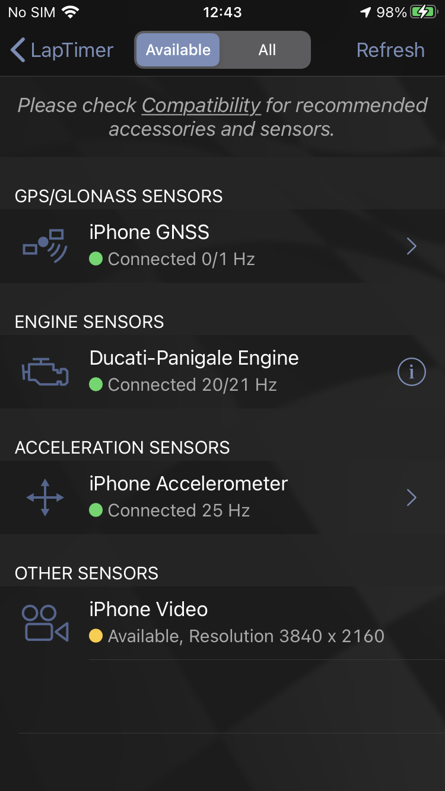
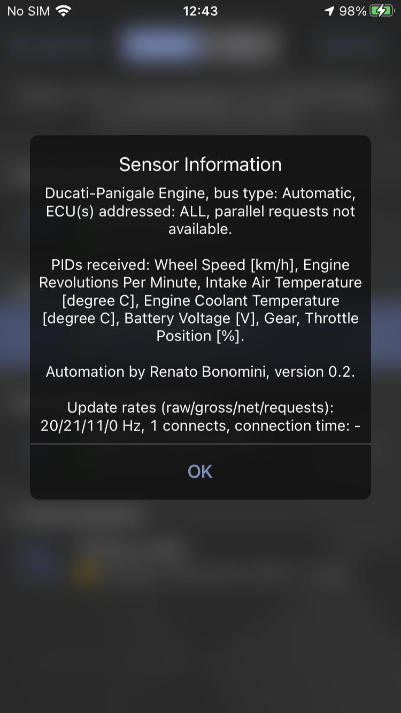
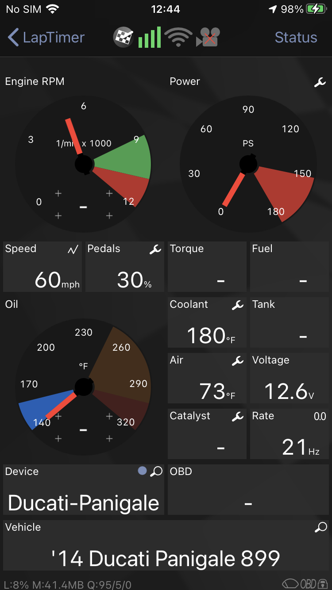

### aud

HLT will connect to any nearby device matching a name of "DuCan-...." where the 4 dots match an id unique to your device.

If you need to deterministically connect to a specific device

- Open Administration
- go to Settings
- scroll down to Expert Settings
- scroll down to Custom BTLE ODB Adapter
- in 'Peripheral Name' add the full name of your device, e.g. DuCan-#499 or DuCan-8409. You can once again use a single `.` to specify 'any character

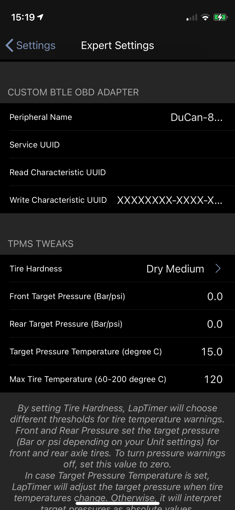

## Building the software in Platform IO and Arduino IDE

This project is best handled with Platform.io. Nonetheless, it uses the Arduino framework so you can use the Arduino IDE as well.

Steps required to compile this in the Arduino IDE

- copy content of `src` and `include` into your sketch folder
- perform a `git clone https://github.com/timurrrr/arduino-CAN` in the sketch folder, or copy a zip file from github directly
- move the content of `arduino-CAN/src` in the main folder of your sketch

### OTA updates with DoubleResetDetector

When the unit is tucked away, updates via USB are inconvenient. The "Double Reset Detector" library will be triggered after a double "reset" activity within 5 seconds (configurable), with these series of actions

- start WiFi in Access Point mode
- start OTA in listening mode

The AP name is based on the `DEVICE_ID`  macro, and it includes the 4 digits identifying the unit. At that point, mDNS starts and after connecting to the ESP32 Access Point you can upload to the `ducan.local` device.

## Schematics

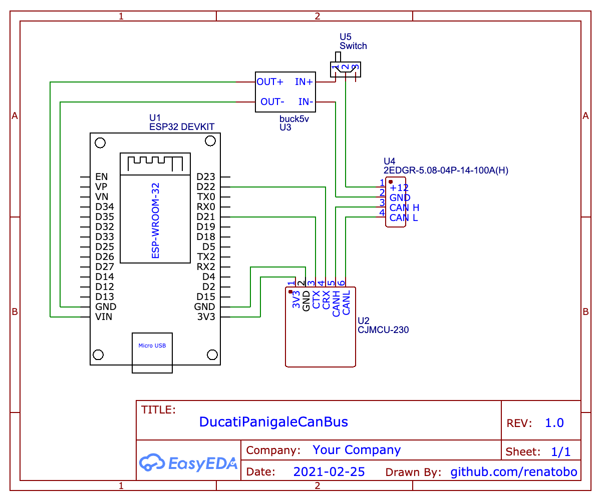

The most complicated and hard to source part is the 4 pin adapter to the DDA port (check [monocilindro.com for a nice article on connections](https://www.monocilindro.com/2018/08/26/ducati-monster-797-obd2-dda-diagnostic-connector-and-communication/)

- pin1: +12
- pin2: Ground
- pin3: CAN high
- pin4: CAN low

You can also buy an ODBII adapter and use th ODBII pin schema convention.

In a nutshell:

- Pin1 (+12) and Pin2 (ground) connect to the buck converter to power the ESP32
- Pin3 and Pin4 carry the CANBUS signal going to the transceiver

Since you can use any pin for TWAI, there are 2 options

- use predefined options in [include/canbusble_pinout.h](include/canbusble_pinout.h)
- define via compile time definitions of `TX_GPIO_NUM` and `RX_GPIO_NUM`

## Hardware

Parts: `U<x>` refers to the schematic reported above. Links to sources are examples, these are very generic components.

- U1: A generic ESP32
- U2: [A CANBUS transceiver, such as one based on SN65HVD230](https://www.amazon.com/gp/product/B07ZT7LLSK). Be careful to source a genuine part
- U3: [Buck converter 12V to 5V](https://www.amazon.com/gp/product/B076P4C42B) to power ESP32 from the CANBUS directly
- U4: [4 PINs adapter for Ducati DDA port (male)](https://www.aliexpress.com/item/4001007307044.html)

Misc parts from your HW bin

- U5: small switch (to cut power when not needed) inline with the Input power
- heat shrink tube to protect the cable from the 4 PINs adapter

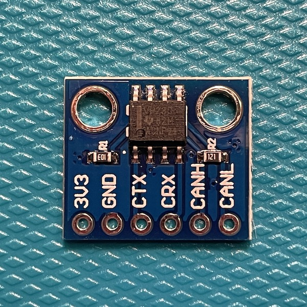
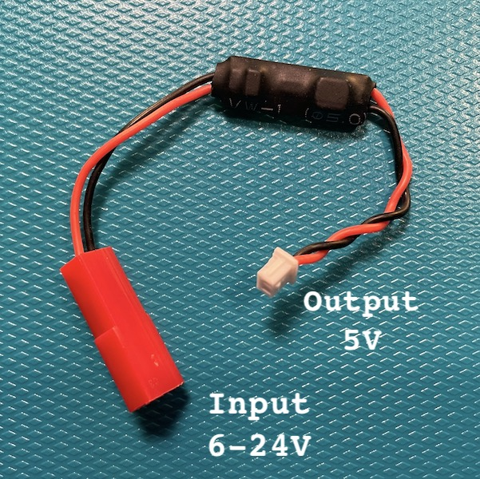
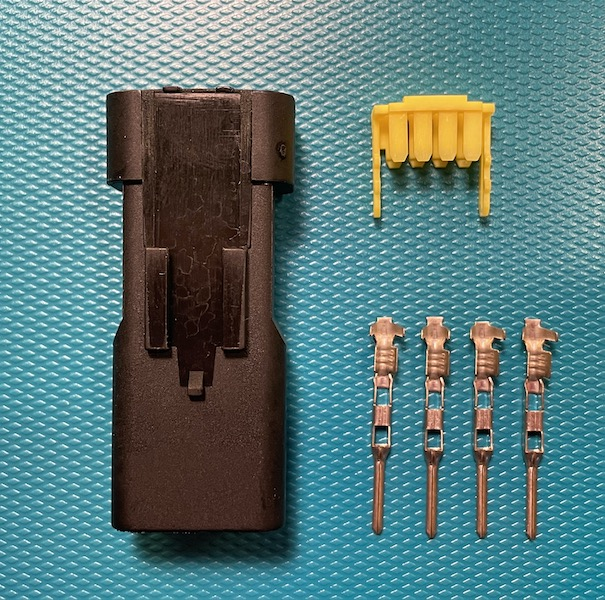
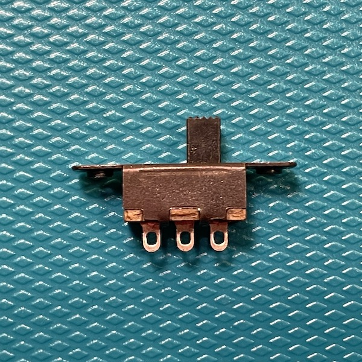

### An example based on common DevKit ESP32 module

The most common ESP32 is the DevKit: the box is 3d printed, [here the source files for DevKit](docs/DuCanBus_DevKit.f3d) of which you should print *box* and *lid*. You will need 4 M1.7 screws 4 to 6 mm long, and a lot of patience:

- hot glue to hold pieces together in a firm location, to avoid issues with vibrations, is recommended
- the transceiver is designed to be locked in position by the two columns: you can melt some plastic to ensure it does not move around

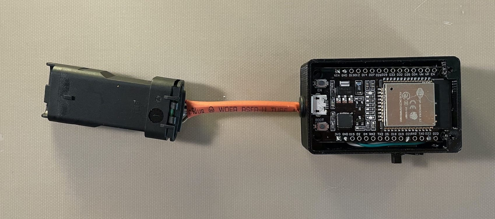

### An example of a compact unit based on Wemos D1mini 32

The smallest esp32 readily available is the D1 mini ESP32: fitting everything in a box that can go in the tail section of the Panigale has been tediously meticolous, but the result works: the box is 3d printed, [here the source files for D1 Mini](docs/DuCanBus.f3d) of which you should print *box* and *lid*. You will need a few M1.7 screws 4 to 5 mm long, and a lot of patience:

- hot glue to hold pieces together in a firm location, to avoid issues with vibrations, is recommended
- the transceiver is designed to be locked in position by the two columns: you can melt some plastic to ensure it does not move around

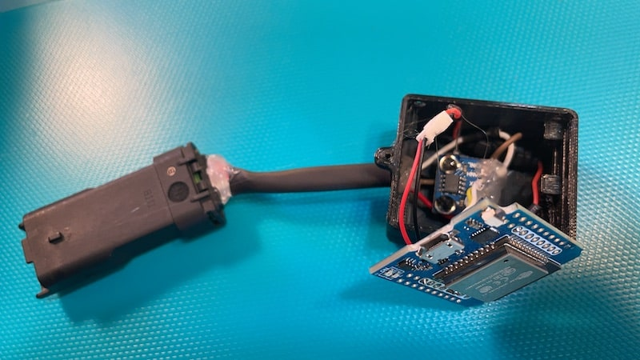

Once closed

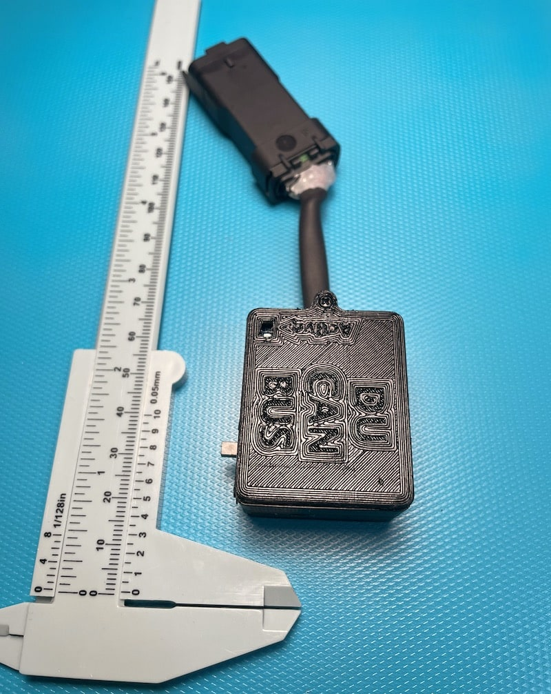

## Credits

Other projects that inspired this work are

- The excellent work performed by MrCanBus [in this thread](https://www.ducati.ms/threads/canbus-data-on-you-android-device-via-bluetooth.337705/) and his [CanBus sniffer](https://github.com/MrCanBus/MTS1200-CANBUS)
- Collective decoding of Ducati CANBUS messages ([spreadsheet](https://docs.google.com/spreadsheets/d/1-NJ9OlGQYTGMzBzwDPYn-aI_7_ign9SCiscKZufx3Uw/edit?pli=1#gid=1950998351))
- Field testing and motivation by [@dookie454](https://github.com/dookie454), including porting to car PIDs and TFT display of data
